# 📢 S.O.S Escola - Sistema de Denúncias Escolares com IA

Através de um projeto inovador com foco em segurança e bem-estar estudantil, estamos desenvolvendo a **S.O.S Escolar**, uma plataforma web voltada ao combate ao bullying e à violência escolar.

A solução permite **denúncias anônimas ou identificadas**, conta com **IA para triagem de urgência** e oferece **suporte emocional automático e humano**.

Além disso, disponibiliza um **dashboard com métricas** para gestores escolares, promovendo ações rápidas e baseadas em dados.

Alinhado aos **Objetivos de Desenvolvimento Sustentável (ODS)**, o projeto visa construir ambientes escolares mais saudáveis, inclusivos e acolhedores.

Desenvolvido com **React**, **Spring Boot**, **Python** e **PostgreSQL com criptografia**.

---

## 🚀 Tecnologias Utilizadas

<div align="left">
  
  
  
  
  
  
  
  
  
  
  
</div>

---

## 📌 Etapas do Projeto

Elaboramos um quadro no Trello, acessível mais abaixo nesta documentação, onde estruturamos **10 histórias de usuário** para nossa aplicação web.

Com base nessas histórias, desenvolvemos **protótipos por meio de esboços e storyboards**, que foram apresentados em formato de **screencasts**.

---

## 👥 Equipe de Desenvolvimento

| Integrante | Perfil |
|-----------|--------|
|  | **Jose Leandro De Morais Alvez Luz**<br>[@jleandromorais](https://github.com/jleandromorais) |
|  | **Gabriel Souza Santos**<br>[@06gabrielsouza](https://github.com/06gabrielsouza) |
|  | **Kayky Dias Oliveira**<br>[@kaykyDias04](https://github.com/kaykyDias04) |
|  | **Levi Moraes Moura Andrade**<br>[@LeviMoraesMoura](https://github.com/LeviMoraesMoura) |
|  | **Enzo Antuna Ferreira**<br>[@Enzo-Antuna](https://github.com/Enzo-Antuna) |

---

## 📌 Status do Projeto

Acompanhe o andamento pelo nosso quadro no Trello:

🔗 [Ver Trello](https://trello.com/b/rqZ4UClp/sos-escola)

### 🖼️ Quadro Atual:

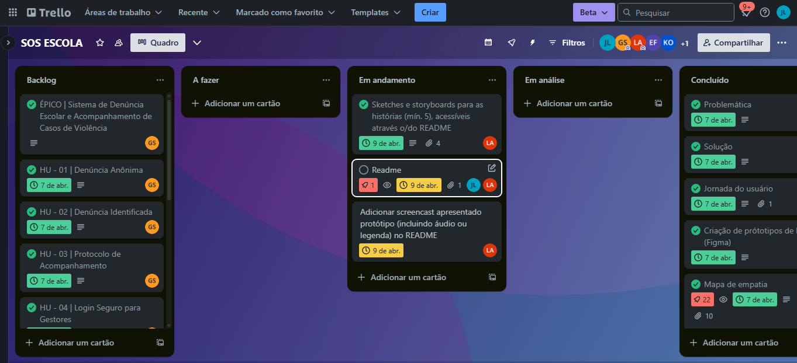

---

## 🧩 Sketches e Storyboards

### HU - 01 | Denúncia Anônima

> *""Como aluno, quero poder fazer uma denúncia de forma anônima para me sentir seguro ao relatar casos de violência.""*


---

### HU - 02 | Denúncia Identificada

> *"Como aluno, quero ter a opção de me identificar na denúncia para permitir uma comunicação direta com os responsáveis pelo acompanhamento."*

Somente com o botão de identificação o usuário pode escolher se quer ser identificado ou não.

---

### HU - 10 | Consentimento para Compartilhamento de Dados

> *”Como denunciante, quero poder autorizar ou não o compartilhamento dos meus dados para garantir minha privacidade”*

No botão o usuário decide se deseja autorizar ou não o compartilhamento dos dados.

---

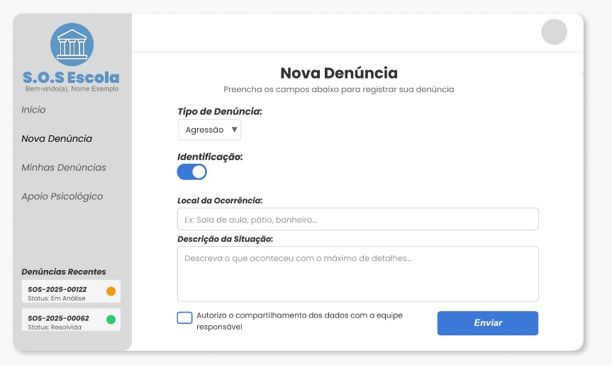  
🔗 **[Acesse o Protótipo](https://www.figma.com/design/LttrqgGPeTN1Wa9hu6Iidk/S.O.S-Escola?node-id=4-154&t=yFIM6FH4iPkxYPMQ-0)**

---

### HU - 08 | Histórico de Denúncias

> *"Como gestor, quero acessar o histórico de denúncias para analisar padrões e agir preventivamente."*

O usuário consegue ver o relatório e estatísticas de cada denúncia.

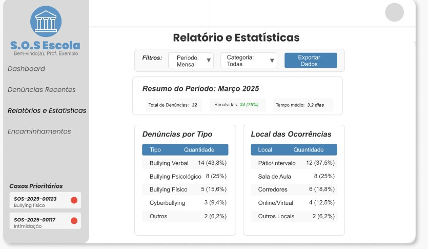  
🔗 **[Acesse o Protótipo](https://www.figma.com/design/LttrqgGPeTN1Wa9hu6Iidk/S.O.S-Escola?node-id=16-1346&t=JMp3T4eBRyYMzpn0-0)**

---

### HU - 03 | Protocolo de Acompanhamento

> *"Como denunciante, quero receber um protocolo para acompanhar o andamento da minha denúncia e saber das providências tomadas."*

Nessa aba, o usuário poderá acompanhar suas denúncias para ver se já foram resolvidas ou não.

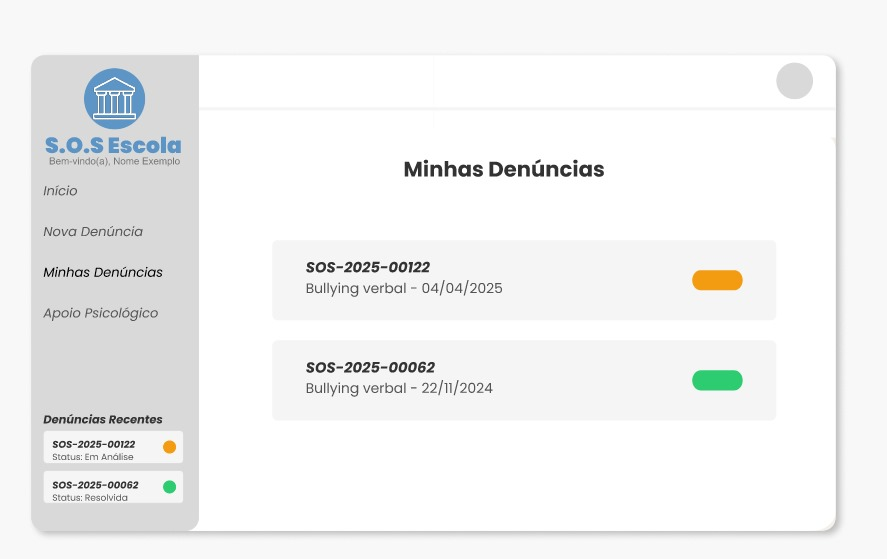  
🔗 **[Acesse o Protótipo](https://www.figma.com/design/LttrqgGPeTN1Wa9hu6Iidk/S.O.S-Escola?node-id=17-2106&t=5bMMeSmH5glecGbu-0)**

---

## 🎨 Protótipos (Figma)

### Telas Principais

---

#### 🔐 Login Seguro (Gestores/Alunos)

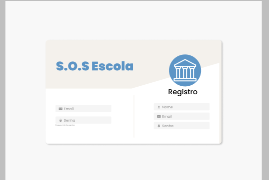  
🔗 **[Acesse o Protótipo](https://www.figma.com/design/LttrqgGPeTN1Wa9hu6Iidk/S.O.S-Escola?node-id=4-212&t=ZTagklqe0qmiMavP-0)**

---

#### 📄 Formulário de Denúncia (com opção de anonimato)

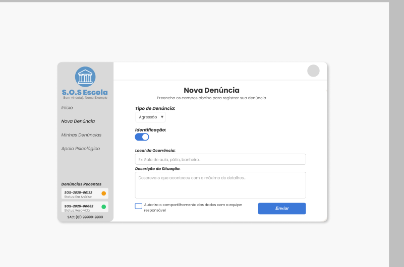  
🔗 **[Acesse o Protótipo](https://www.figma.com/design/LttrqgGPeTN1Wa9hu6Iidk/S.O.S-Escola?node-id=4-154&t=ZTagklqe0qmiMavP-0)**

---

#### 📊 Dashboard de Gestão (métricas e priorização)

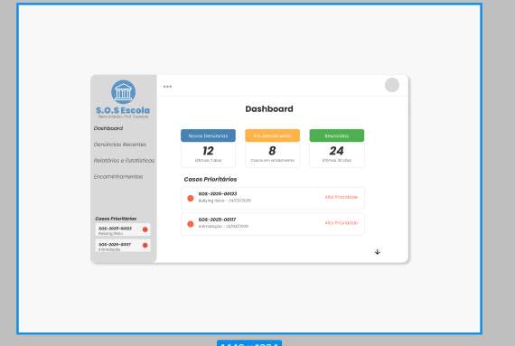  
🔗 **[Acesse o Protótipo](https://www.figma.com/design/LttrqgGPeTN1Wa9hu6Iidk/S.O.S-Escola?node-id=15-828&t=ZTagklqe0qmiMavP-0)**

---

## 🔗 Protótipo Completo

🔗 **[Acesse o Protótipo Completo no Figma](https://www.figma.com/design/LttrqgGPeTN1Wa9hu6Iidk/S.O.S-Escola?node-id=0-1&p=f)**

---

## 🎥 Demonstração do Protótipo

[](https://www.youtube.com/watch?v=9jkoFB42xww)

---

# 📌 Sprint Atual – Entrega 02  

## ✅ Histórias Selecionadas para a Sprint

1. **HU - 01 | Denúncia Anônima**
2. **HU - 02 | Denúncia Identificada**
3. **HU - 10 | Consentimento para Compartilhamento de Dados**

Essas histórias foram priorizadas por estarem relacionadas às funcionalidades centrais do sistema de denúncias e à privacidade do usuário.

---

## 📊 Diagrama de Atividades do Sistema
 **HU - 01**
  
  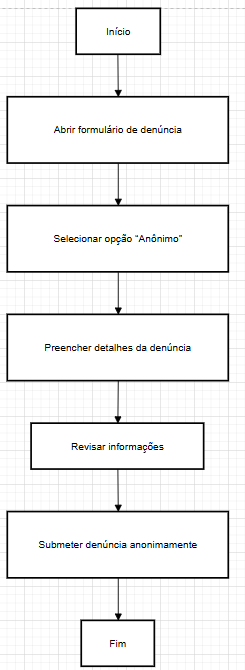

 **HU - 02**

  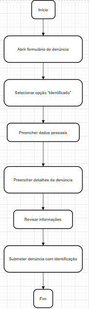

 **HU - 10**

  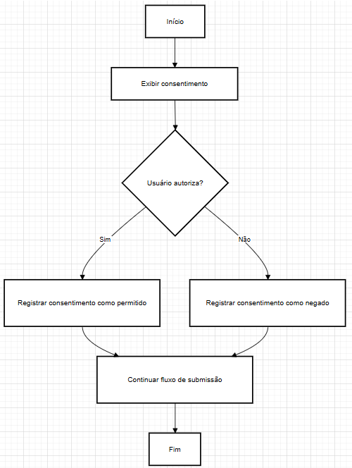


---

## 🌐 Ambiente de Versionamento

- Repositório GitHub: [ 📁 link aqui](https://github.com/jleandromorais/S.O.S-escola.git)
- Commits frequentes 

📸 **Print do histórico de commits:**


---

## 🐞 Issue / Bug Tracker

Utilizamos o sistema de issues do GitHub para organização de tarefas e bugs.

📸 **Print das issues abertas e fechadas:**
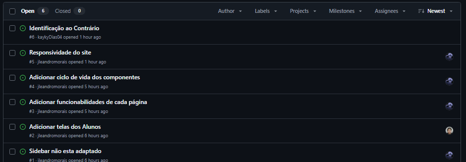

---

## 🚀 Deployment

- Link para acesso ao sistema/protótipo:[🔗 Acesse o sistema aqui](https://s-o-s-escola-h9hs.vercel.app)


🎥 **Screencast demonstrando o uso do sistema:**  
Inclui áudio ou legenda explicativa  
[](https://youtu.be/k0Aud9j7v5Q)


---

## 👥 Pair Programming

Nesta sprint, **não utilizamos a prática de Pair Programming** devido à incompatibilidade de horários entre os membros da equipe, o que impossibilitou o desenvolvimento simultâneo das tarefas.  
Optamos por dividir as atividades individualmente, de acordo com a disponibilidade de cada integrante. Ao final do processo, foram realizadas **revisões do resultado final** de cada funcionalidade desenvolvida, garantindo que todos estivessem alinhados com os objetivos da sprint.  
Reconhecemos os benefícios da programação em par e pretendemos viabilizá-la nas próximas entregas, buscando uma melhor colaboração e qualidade do código.

---

## 📌 Quadro da Sprint 01 Atualizado

📸 **Print do quadro do Trello da Sprint 01:**

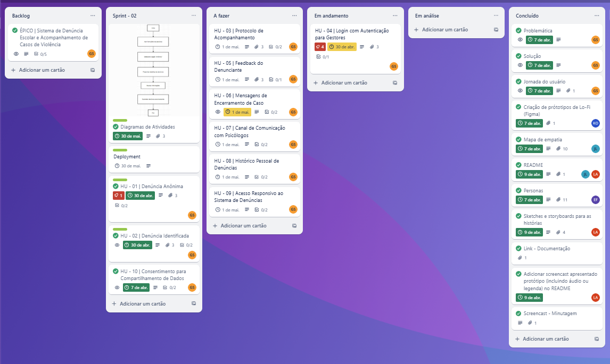

📸 **Print do backlog atualizado:**

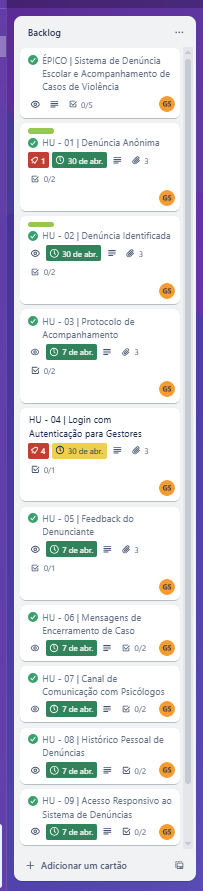

---

#
# Adicionando Ícones Font Awesome e React Icons em Projetos React.js

Você utilizaria os comandos 

- `npm install --save @fortawesome/fontawesome-svg-core`
- `npm install --save @fortawesome/free-solid-svg-icons`
- `npm install --save @fortawesome/react-fontawesome`

**quando precisa integrar a biblioteca de ícones Font Awesome a um projeto React.js**.

Além disso, pode usar:

- `npm install react-icons`

**quando deseja uma alternativa mais simples e versátil, que reúne diversas bibliotecas de ícones famosas em um único pacote para projetos React.js**.

---

## Por que e Quando Instalar Esses Pacotes?

Esses pacotes são essenciais para **adicionar ícones escaláveis (SVG) ao seu aplicativo React de forma otimizada**. A instalação é feita geralmente nos seguintes momentos:

1. **No Início do Projeto ou ao Decidir Usar Ícones:** É comum instalá-los logo no começo do desenvolvimento, junto com outras dependências de interface do usuário, se você já planeja usar ícones.

2. **Para Melhorar a Experiência do Usuário (UX) e a Interface (UI):** Ícones tornam a navegação mais intuitiva, os botões mais claros e o design geral do aplicativo mais atraente e profissional.

3. **Para Ter Ícones Escaláveis e Leves:** Os ícones SVG mantêm a nitidez perfeita em qualquer tamanho e são muito leves, contribuindo para a performance do seu aplicativo sem perdas de qualidade visual.

4. **Para Ter Mais Opções e Facilidade:** Ao instalar o `react-icons`, você tem acesso a várias bibliotecas de ícones (Font Awesome, Material Icons, Ant Design, Bootstrap Icons, entre outros) de forma unificada e com uma sintaxe extremamente simples.

---

## O que Cada Pacote Faz?

### Pacotes do Font Awesome:

- **`npm install --save @fortawesome/fontawesome-svg-core`**
  - Este é o **motor principal** do Font Awesome para JavaScript. Ele gerencia como os ícones são registrados, processados e exibidos em seu aplicativo. É a base que permite que todos os outros pacotes de ícones funcionem corretamente.

- **`npm install --save @fortawesome/free-solid-svg-icons`**
  - Este pacote contém a **coleção de ícones "sólidos" (preenchidos)** que o Font Awesome oferece gratuitamente. O Font Awesome organiza seus ícones por diferentes estilos (sólido, regular, light, duotone, de marcas, etc.). Este comando instala especificamente o conjunto de ícones sólidos, que é um dos mais utilizados.

- **`npm install --save @fortawesome/react-fontawesome`**
  - Este é o **componente específico para React**. Ele fornece uma interface fácil e otimizada para você utilizar os ícones do Font Awesome diretamente dentro dos seus componentes React, usando a sintaxe JSX. É ele que transforma os dados dos ícones em elementos que o React pode renderizar na sua interface.

### Pacote React Icons:

- **`npm install react-icons`**
  - Este pacote oferece uma solução **mais simples e leve para usar ícones em React**. Ele reúne várias bibliotecas populares de ícones em um só lugar, incluindo Font Awesome, Material Design, Ant Design, Feather, Bootstrap Icons e outras.
  - Você importa apenas os ícones que precisa, de forma otimizada.  
  Exemplo de uso:

```jsx
import { FaBeer } from 'react-icons/fa';

function App() {
  return <h3>Vamos tomar uma cerveja? <FaBeer /></h3>;
}

